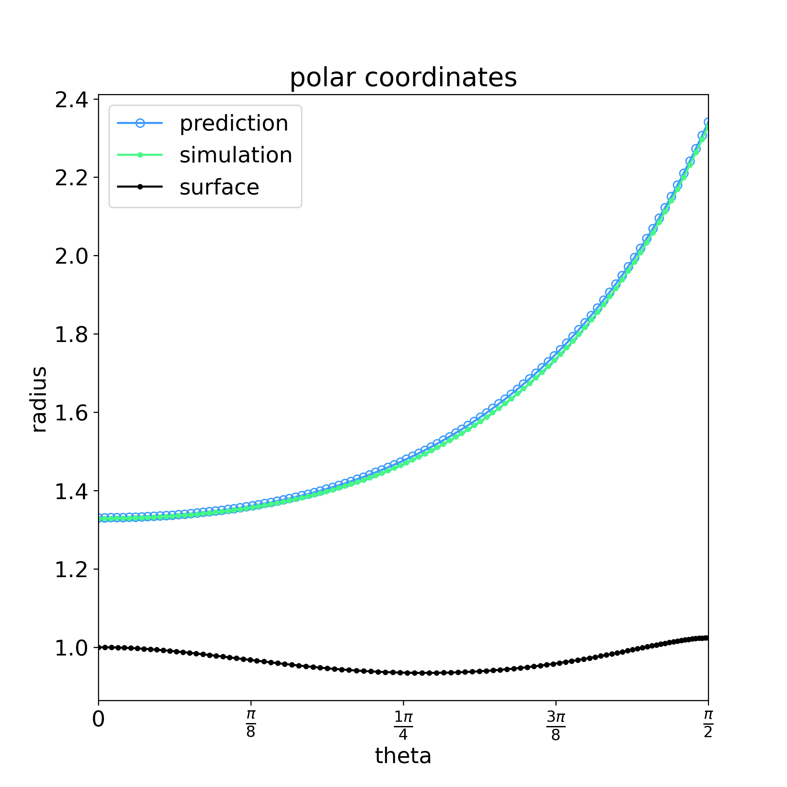

# ML-SF
Idea: randomised inflow + random-ish distorted cylinder + Eilmer shock-fitting  
    --> bow shock profile + ML  
        --> general relation for shape for grid gen?

## Randomised parameter bounds
Mach number -> [2.0, 8.0]  
temperature -> [300.0, 800.0] K

R1 constant, 1.0  
R2, K1, K2 randomly set around 1.0

## Example from fit model
R1 = 1.0  
R2 = 1.024010845383956037e+00  
K1 = 5.559842733496153100e-01  
K2 = 2.493385792650427979e-01  
M  = 7.985859177691415844e+00  
T  = 6.662489193564000516e+02  

correct coefficients polynomial fit for shock in polar coordinates:  
&space;=&space;a_n&space;\theta^n)  
coeffs = [1.329053681099242601e+00, -2.381378425592319166e-03, 1.815951977252002747e-01, -7.257403682239993437e-02, 2.686813008048670737e-01, -1.739286381676704019e-01, 5.769665095911536562e-02]

